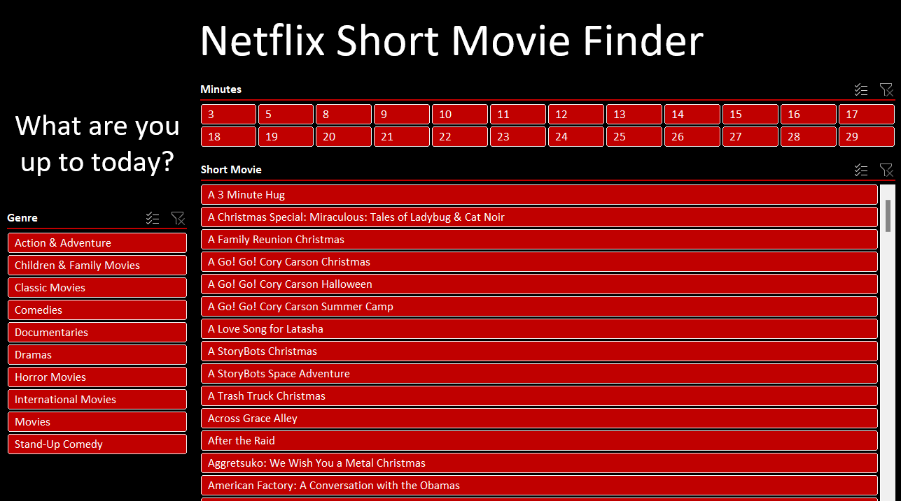
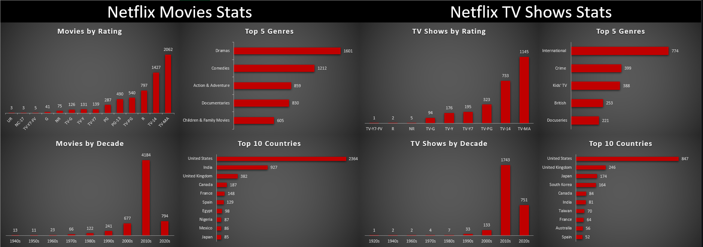
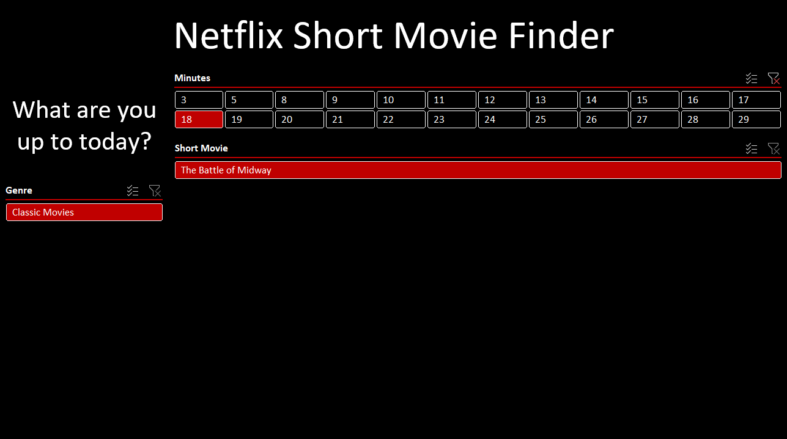

# Netflix Short Movie Finder

## Table of Contents

- [Project Overview](#project-overview)
- [Data Sources](#data-sources)
- [Tools](#tools)
- [Data Cleaning/Preparation](#data-cleaning/preparation)
- [Exploratory Data Analysis](#exploratory-data-analysis)
- [Data Analysis](#data-analysis)
- [Recommendations](#recommendations)
- [Limitations](#limitations)
- [References](#references)

### Project Overview
In this project we clean data from a recent Netflix database in Power Query. With the cleaned data we identify various aspects of the Netflix's Catalogue by showing some insights. Leveraging this dataset, we then create a functional Short Movie Finder. In addition, we model the data for further analysis.

### Data Sources

Netflix Data: The primary dataset used for this analysis is the "netflix_titles.csv" file, containing detailed information about Netflix's Movies & TV Shows Catalogue.

### Tools

- Power Query - Data cleaning & Modeling [[Download here]](https://powerquery.microsoft.com/en-us/)
- Excel - Data Analysis, Creating the Finder & reports [[Download here]](https://office.com/en-us/)

### Data Cleaning/Preparation

In the initial data preparation phase, we performed the following tasks:
1. Data loading and inspection
2. Handling missing values.
3. Data cleaning and formatting

### Exploratory Data Analysis

EDA involved exploring the Catalogue data to answer key questions, such as:

- Which genres are the most popular in movies/TV shows?
- Which are the ratings with most content in movies/TV Shows?
- How is the content distributed by decade?
- Which countries have the most content from?

### Data Analysis

- When I realized that the catalogue was mostly updtated, I wanted to see how could I use it to improve my Netflix experience. One of the greatest pain point I find with their platform is the time I waste when choosing what to watch. Also, there is not much room to filter the movies by duration, only by genre. With this in mind, and knowing that there might be a lot of unkown good short movies I created the short movie finder in order to erase the multiple options that makes me spend more time deciding than watching.

### Recommendations

- Adding a time-filter in the UI would be great to find hidden gems in the catalogue and could potentially help improve the experience of indecisive users.

### Limitations

- The Catalogue is not fully updated and one may experience region restrictions

### References

This was my first solo-project. But I did have the constant help of [ChatGPT](https://chat.openai.com/) for every minor detail that I didn't know how to handle. 
